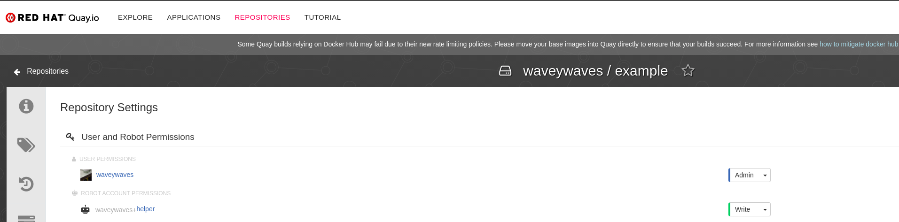
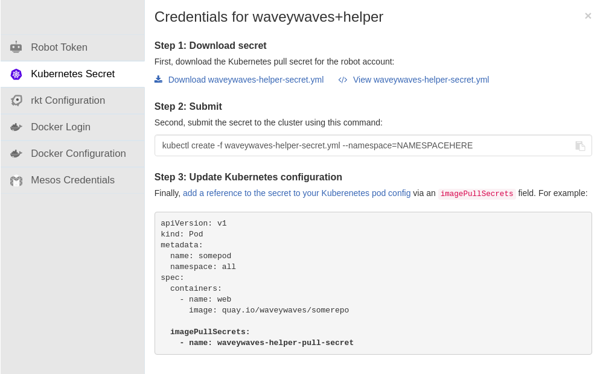

Building custom Jenkins Images
------------------------------
Custom Jenkins images can be build with the required plugins using the *JenkinsImage* Custom Resource.

Prerequisites
~~~~~~~~~~~~~
To allow the Operator to build and push your custom Jenkins image we will need credentials to the repository you would
be pushing to. In this case, we will use quay as an example.

You will need a repository with a `Robot` added with `Robot Account Permissions` given as `Write`. Please check
https://docs.quay.io/glossary/robot-accounts.html[this] documentation for further details.



After the above is done, we will use the credentials of the robot account to push to the quay repository. To use them,
we need to download the secret as a Kubernetes *Secret* so that we can reference it in the *JenkinsImage*.



Once you download your secret apply it as follows

```shell
$ kubectl apply -f waveywaves-helper-secret.yml
```

After the above we have everything necessary to get started with building our custom Jenkins image.

JenkinsImage
~~~~~~~~~~~~

_JenkinsImage example_
```
apiVersion: jenkins.io/v1alpha2
kind: JenkinsImage
metadata:
  name: jenkinsimage-corpo-special
spec:
  from:
    name: jenkins/jenkins
    tag: lts
  plugins:
  - name: kubernetes
  to:
    registry: quay.io/corpo
    name: jenkins-for-corpo
    tag: latest
    secret: waveywaves-helper-secret
```

In the above *JenkinsImage* definition, we have provided the reference for the secret we have created earlier which
would be used for pushing the image to the repo.

from
^^^^
Defines which Jenkins base image needs to be used. This image can be changed based on the version of Jenkins the user
prefers to use. All the different tags can be seen
https://hub.docker.com/r/jenkins/jenkins/tags?page=1&ordering=last_updated[here].

plugins
^^^^^^^
Here you can note the plugins you would like to install in your Jenkins image. You can provide plugins with or without
the version. By default, plugins with latest versions would be created.

to
^^
Defines where you would like to push the final Jenkins image you would like to use in production.

Upon creating a *JenkinsImage* Custom Resource a pod would be created which would build Jenkins using Kaniko. For
debugging what went wrong during the build of the Jenkins image, users can check the pod logs.