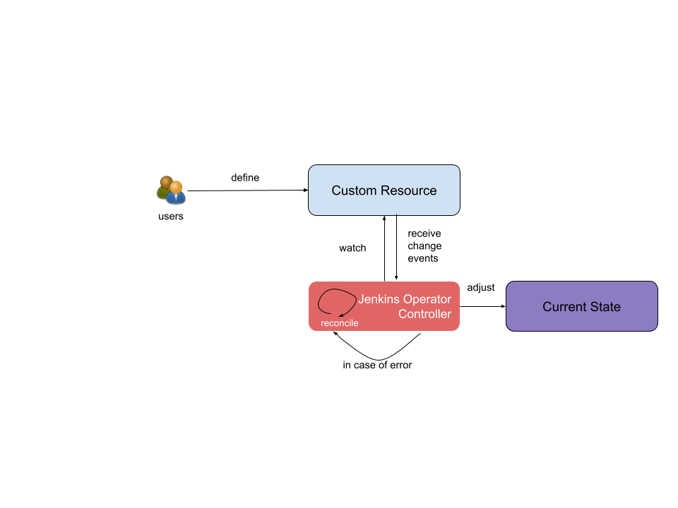

<!--
Copyright The Jenkins Automation Operator Contributors

SPDX-License-Identifier: Apache-2.0
-->

Jenkins Operator Overview
--------------------------
The Jenkins Operator is a software extension to Kubernetes that make use of custom resources to manage Jenkins instances and their components. Operators follow Kubernetes principles, notably the control loop.

Jenkins Operator Controllers
^^^^^^^^^^^^^^^^^^^^^^^^^^^^

Jenkins Operator provides the following controllers:
- `jenkins controller`: Watches `Jenkins` resource definition and instantiates a Jenkins instance relying on the 
specified Jenkins definition or  defaults if none specified. The applied and calculated values are then reported in the `Jenkins.Status.Spec` field. The created
 Jenkins instance is backed with the following kubernetes objects:
  - `Deployment` resource defining the `Pod` running the `Jenkins` container
  - `Pod` composed of 2 or 3 containers (depending wether backup is enabled or not).
  - `ServiceAccount` used to run the `Jenkins` pod. It is also assigned the `edit` `ClusterRole`
  - `Route` allowing access to the Jenkins instance
  - `ConfigMap` storing the CASC configuration
If any of these resources are deleted or modified, the `Jenkins controller` will reconcile their statuses with the specified specification or using default values.

- `jenkinsimage controller`: Watches `JenkinsImage` resource definitions and is in charge of creating `kaniko` `pod` to build a Jenkins image 
with the specified set of jenkins `Plugins`. When running on `OpenShift` this controller tries to detect the `OpenShift Internal Registry` in order to push 
built images in it. If a user specifies an alternate destination, the `JenkinsImage Controller` will push to another registry.
- `backup controller`: Watches `BackupStrategy` resource definition and enable backup of the associated Jenkins instance. The backup is performed using a
sidecar container containing required tools to perform the backup triggered using a `kubeExecClient`  and by gracefully stopping Jenkins before backup. The backup is then stored under the `JENKINS_HOME` directory and a `Backup` custom resource is created.
- `restore controller`: Watches `Restore` resource definition and perform restoration of the specified `Backup` object to the specified `Jenkins` instance.
The following image illustrate the interactions between these controllers.

Learn more
^^^^^^^^^^

See the following docs referencing each of the Kubernetes resources currently supported:

- [`Jenkins`](jenkins.md)
- [`JenkinsImage`](jenkinsimage.md)
- [`BackupStrategy`](backup.md)
- [`Restore`](restore.md)

Controllers Flow
^^^^^^^^^^^^^^^^

The following image illustrate the interactions between the `Jenkins`, `JenkinsImage` `Backup` and `Restore` controllers.

